# Memorial da Capoeira

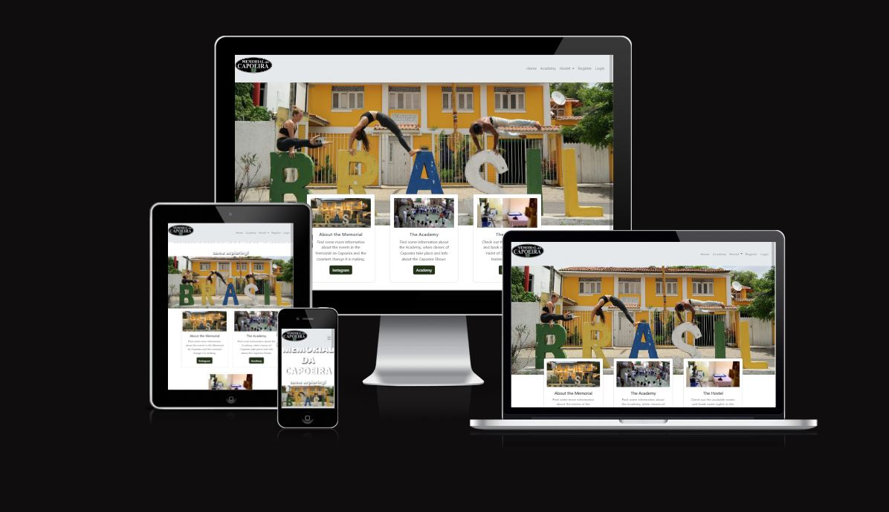
The Live Webpage can be found within this link: https://firsteverfullstack-7b5d63bca638.herokuapp.com

## Table of Content
1. [Strategy](#strategy)
    1. [Agile](#agile)
    2. [Project Goals](#project-goals)
2. [User Experience](#user-experience)
    1. [Target Audience](#target-audience)
    2. [User Requirements & Expectations](#user-requirements-&-expectations)
    3. [User Stories](#user-stories)
3. [Design](#design)
    1. [Colours](#colours)
    3. [Fonts](#fonts)
    4. [Structure](#structure)
    5. [Existing Features](#existing-features)
    6. [Wireframes](#wireframes)
4. [Technologies Used](#technologies-used)
    1. [Frameworks](#frameworks)
    2. [Other Tools](#other-tools)
5. [Data Structure](#data-structure)
    1. [Models](#models)
    2. [Reusable Code](#reusable-code)
7. [Deployment](#deployment)
   1. [Project setup](#project-setup)
   2. [Heroku Deployment](#heroku-deployment)
   3. [Final Deployment](#final-deployment)
   4. [Local Deployment](#local-deployment)
9. [Testing](#testing)
10. [Deployment](#deployment)
11. [Credits](#credits)
    1. [Media](#media)
    2. [Code](#code)
12. [Acknowledgments](#acknowledgments)


<a name="strategy"></a>
## Strategy

<a name="agile"></a>
### Agile
The Agile methodology was used to plan the project. Github was used as the tool to demonstrate this.
Projects were used to divide the project into three iterations with a simple Kanban board.
Milestones were used to create Epics with a custom template
Issues were used to create User Stories with a custom template. Eash user story is clearly described with a title, statement, acceptance criteria and tasks
Each user story was linked to an Epic and placed within one of three Iterations. The user stories were labelled 'must do' 'could do' and 'should do' in order to prioritise the work. As work on a user story was begun the story was moved from the 'to do' column of the board to the 'In progress' column. When work on the story was complete the user story was moved into the 'done' column.

<a name="project-goals"></a>
### Project Goals
The goals of this website are the following:
- providing the user a website with information about the Academy and the Hostel of the Memorial da Capoeira
- providing the user the possibility to reserve a room in the Hostel and manage her/his bookings

<a name="user-experience"></a>
## User Experience

<a name="target-audience"></a>
### Target Audience

The target audience are people who want to get information about the Memorial da Capoeira and/or reserve a room in the hostel.

<a name="user-requirements-&-expectations"></a>
### User Requirements & Expectations
- A simple and intuitive navigation system
- Links and functions that work as expected
- Good presentation and a visually appealing design regardless of screen size
- Accessibility

<a name="user-stories"></a>
### User Stories
1. As a Site User I can understand the structure of the website so that I can navigate it easily (must-do / DONE)
2. As a Site User I can use the nav bar so that I can navigate the pages easily (must-do / DONE)
3. As a Site User I can check the footer so that I can know the address of the hostel (should-do / DONE)
4. As a Site User I can understand if a room is available so that I can confirm my booking (must-do / DONE)
5. As a Site User I can check the availability of a room so that I can make a booking (must-do / DONE)
6. As a Site User I can navigate to the "Academy" page so that I can read about the classes and social impact of the Memiral da Capoeira (should-do / DONE)
7. As a Site User I can log in so that I can make a booking (must-do / DONE)
8. As a Site User I can manage my booking so that I can cancel my booking even afterwards (must-do / DONE)
9. As a Site User I can manage my booking so that I can change my booking afterwards (should-do / TO DO)
9. As a Site User I can manage my booking so that I can change my booking afterwards (should-do / DONE)
10. As a Site User I can navigate to the "memorial" page so that I can read about the building and history of the Memorial da Capoeira (could-do / TO DO)
11. As an admin I can manage the users in the backend so that I can create and delete users, if necessary (must-do / DONE)
12. As an admin I can see all bookings in the front-end so that I could delete bookings for any user (if wished so) (should-do / DONE)
13. As an admin I can use defensive programming so that I can prevent users from booking rooms in the past (must-do / TO DO)
13. As an admin I can use defensive programming so that I can prevent users from booking rooms in the past (must-do / DONE)

<a name="design"></a>
## Design

<a name="colours"></a>
### Colours
The colour palette was chosen to match the colourful theme of the background image. A color picker was used to pick colors from the background image.
<details><summary>Colour palette</summary>
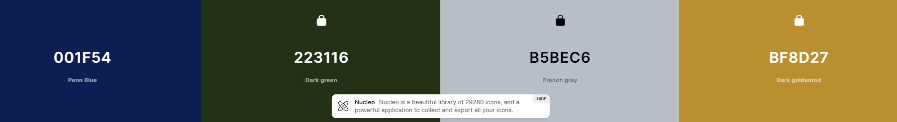
</details>

<a name="fonts"></a>
### Fonts
The standard fonts of bootstrap were used.

<a name="structure"></a>
### Structure
The page is structured beginning from the Homepage. From here the user can navigate via the navbar or the cards on the homepage to the academy page or the page with the rooms. When pressing the bottom "book this room", the user will be asked to register or login. When logged in, the user can create a booking and access her/his bookings from the navbar.

<a name="existing-features"></a>
### Existing Features
<details><summary>All Pages</summary>
    Logo with link to the homepage:<br> 
    
    <br><br>
    Navbar:<br>
    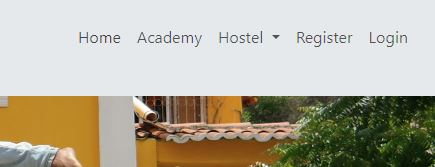
    <br><br>
    Footer:<br> 
    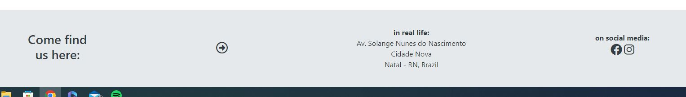
    <br><br>
</details>
<details><summary>Homepage</summary>
    Banner with an image of the Memorial da Capoeira:<br> 
    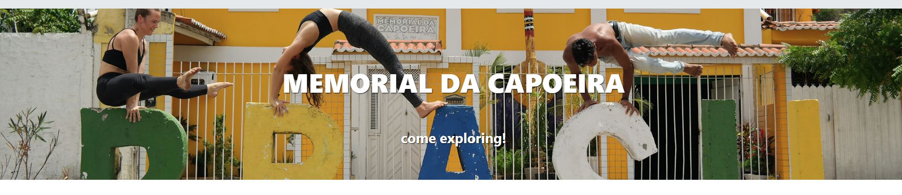
    <br><br>
    Cards with a more visual navigation to the Academy page and the Room booking page, as well as a link to the Instagram Page for more information:<br> 
    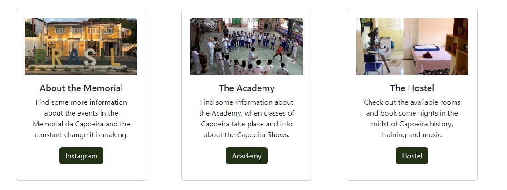
    <br><br>
</details>
<details><summary>Academy Page</summary>
    Banner with an image of Palm trees:<br> 
    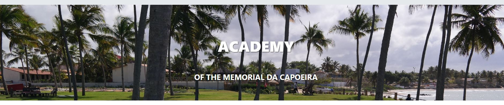
    <br><br>
    A bootstrap carousel with an overview over the classes that can be taken in and around the Memorial (3 slides):<br>
    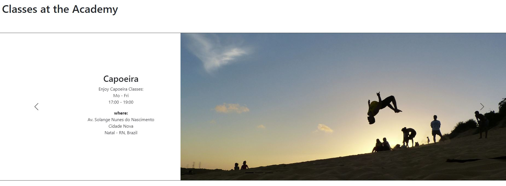
    <br><br>
</details>
<details><summary>Room Booking Page</summary>
    Overview over the available rooms in the Hostel and an option to book them. In case the user is logged in, she will be directed to the booking form, in the case she is not authenticated, she will be directed to the login page:<br> 
    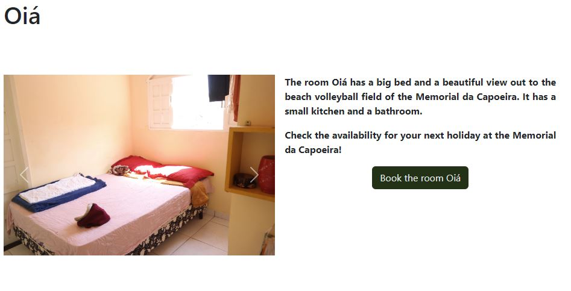
    <br><br>
</details>
<details><summary>My Bookings PageE</summary>
    A button leading back to the room booking page and cards that show the bookings of the logged in user (or - in case of the admin - all bookings):<br> 
    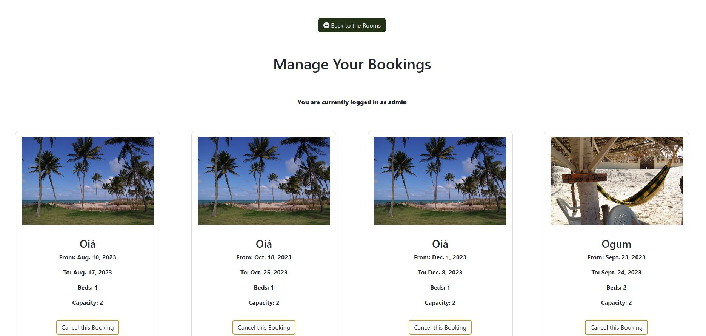
    <br><br>
</details>
<details><summary>Signup Form</summary>
    A form to register as a new user:<br> 
    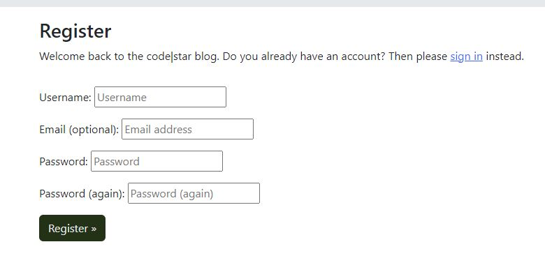
    <br><br>
</details>
<details><summary>Signin Form</summary>
    A form to sign in as a registered user:<br> 
    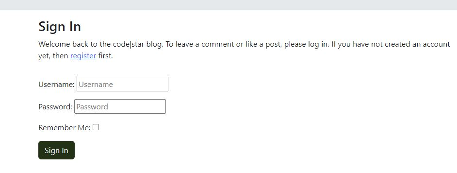
    <br><br>
</details>
<details><summary>Signout Form</summary>
    A form to sign out with a confirmation button, asking if the user really wants to sign out:<br> 
    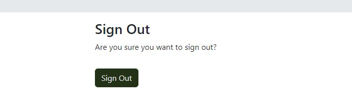
    <br><br>
</details>
<details><summary>Book The Room Form</summary>
    A form to check the availability of the room the user navigated to and reserve the room in case it is available:<br> 
    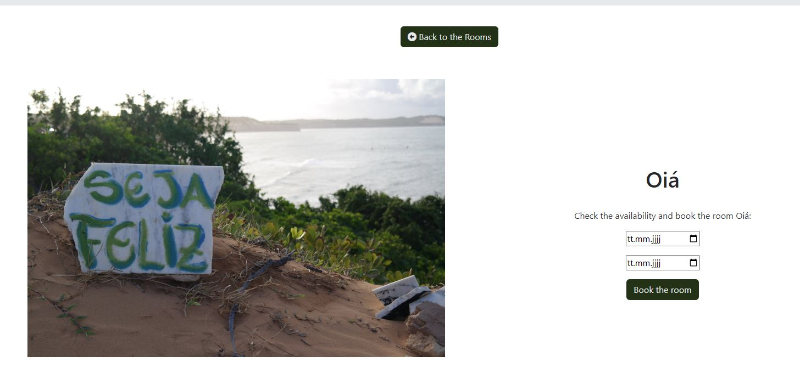
    <br><br>
    A bootstrap flash message informing the user that the room is booked. The user is redirected to the Room booking page:<br> 
    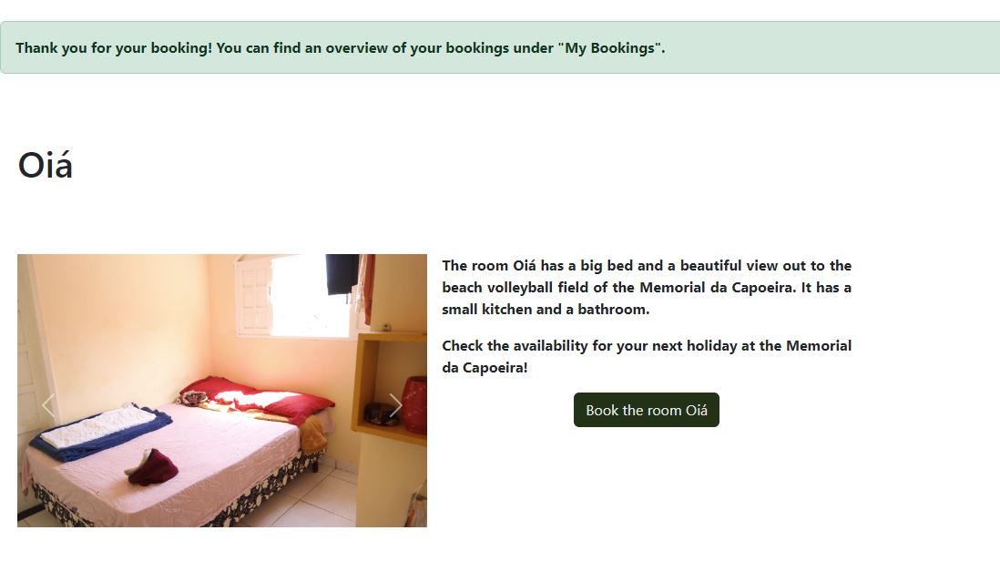
    <br><br>
    A bootstrap flash message informing the user that the room is not available in the time chosen. The user is kept at the Booking form page:<br> 
    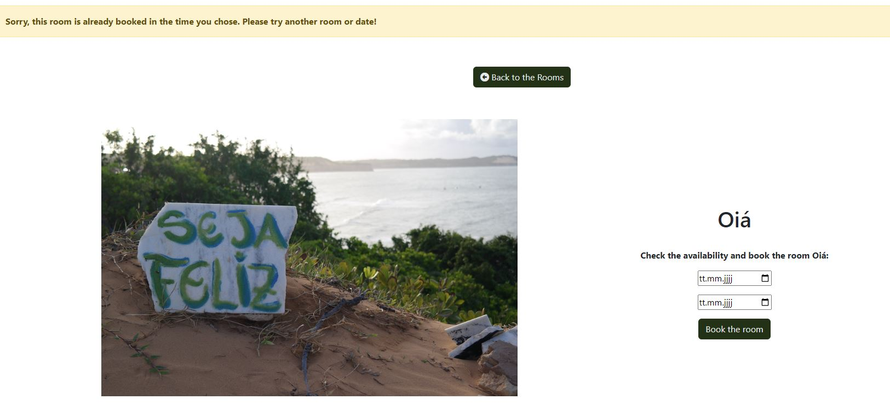
    <br><br>
</details>

<a name="wireframes"></a>
### Wireframes
<details><summary>Wireframes</summary>

</details>

<a name="technologies-used"></a>
## Technologies Used
* [HTML5](https://en.wikipedia.org/wiki/HTML5) was used to build the front-end website
* [CSS](https://en.wikipedia.org/wiki/CSS) was used to style the HTML and add responsiveness
* [JavaScript](https://www.javascript.com/) (no custom JS) was used with Bootstrap to provide interaction on the front-end
* [Bootstrap 5.1.3](https://getbootstrap.com/docs/5.0/getting-started/introduction/) was used to style the website, add responsiveness and interactivity
* [Python](https://www.python.org/) was used to code the back end of the project

<a name="frameworks"></a>
### Frameworks
* [Django 3.2.8](https://docs.djangoproject.com/en/3.2/)
* Django supporting libraries:
  - [allauth](https://django-allauth.readthedocs.io/en/latest/installation.html) for authentication, registration, account management as well as 3rd party (social) account authentication
  - [gunicorn](https://gunicorn.org/) as the server for Heroku
  - [psycopg2](https://pypi.org/project/psycopg2/)as an adaptor for Python and PostgreSQL databases
  - [dj-database](https://pypi.org/project/dj-database-url/) to parse the database URL from the environment variables in Heroku
  - [widget_tweaks](https://pypi.org/project/django-widget-tweaks/) to choose the check-in and check-out dates with a datepicker

<a name="other-tools"></a>
### Other Tools
* [Gitpod](https://cloudinary.com/) as the IDE
* [Git](https://git-scm.com/) used for version control via the terminal in Gitpod
* [GitHub](https://github.com/) used to store the code in the repository
* [Heroku](https://www.heroku.com/) was used as the cloud based platform for deployment
* [Fontawesome](https://fontawesome.com/) for icons
* [Figma](https://www.figma.com/) for the wireframes
* [Iloveimg](https://iloveimg.com/) to resize images
* [Coolors](https://coolors.co) to generate the colour palette
* [Am I responsive](https://ui.dev/amiresponsive) to generate the mockup
* [Google Chrome Dev Tools](https://developer.chrome.com/docs/devtools/) for inspection during development to check reponsiveness and contrast and JS errors in the console
* [W3C Markup Validation Service](https://validator.w3.org/)
* [W3C CSS Validation Service(Jigsaw)](https://jigsaw.w3.org/css-validator/)
* [PEP8](https://www.python.org/dev/peps/pep-0008/) to validate the Python code
* Lighthouse in dev tools for testing

<a name="data-structure"></a>
## Data Structure

<a name="models"></a>
### Models
The following models are included in the project:

* **Room:** where all data about the rooms is stored.

| key          | Name          | Type                   |
|--------------|---------------|------------------------|
|              | rooms         | Tuple of Rooms         |
| PK           | id            | Integer                |
|              | name          | Char[20],choices=rooms |
|              | beds          | Integer                |
|              | capacity      | Integer                |


* **Booking:** where all data of the bookings is stored.

| Key | Name             | Type           |
|-----|------------------|----------------|
| FK  | users            | AUTH_USER_MODEL|
| FK  | room             | RoomModel      |
|     | check_in         | DateTime       |
|     | check_out        | DateTime       |

<a name="reusable-code"></a>
### Reusable Code
The booking function of the app 'hostel' is put in a separate folder in order to easily be able to reuse it for other projects, that also require some kind of booking system. This could be booking tickets for an event or booking a surf/yoga/capoeira class, for example.

<a name="testing"></a>
## Testing
The full testing documentation can be seen [here](TESTING.md).

<a name="deployment"></a>
## Deployment

<a name="project-setup"></a>
### Project setup
<details><summary>INSTALL DEPENDENCIES</summary>
First, it is needed to create a virtual environment, which is a folder that contains a Python installation and all the packages needed for the project. This is done by running the following command at the root of the project:

```Python
python3 -m venv .venv
```

**NOTE**: The name of the virtual environment folder is .venv, which is the default name. If you want to use a different name, you should add the name of the folder to the .gitignore file.
Then, the virtual environment is activated by running the following command:

```Python
source .venv/bin/activate
```

Finally, the dependencies are installed by running the following command:

```Python
pip3 install django gunicorn dj_database_url urllib3 psycopg2 django-allauth django-widget-tweaks
```

**Django**, is the main framework used to create the application. It allows the developer to create a web app using Python.
**Gunicorn** is a web server that is used to deploy the application to Heroku. dj_database_url is a package that allows the developer to connect to a database.
**urllib3** is a package that allows the developer to make HTTP requests.
**psycopg2** is a package that allows the developer to connect to a PostgreSQL database.
**allauth** is a package that allows extensive user authentication and authorization
**widget_tweaks** is a package that allows datefields to be filled by a datepicker
</details>

<details><summary>CREATE THE ENVIRONMENT VARIABLES</summary>
First, create a env.py file in the root of the project with the following variables:

```Python
import os   # for os.environ.get
# Set the environment variables
os.environ["DATABASE_URL"]='YOUR_DB_URL'
os.environ["SECRET_KEY"]='YOUR_SCRET_KEY!'
# If you will work with images or static files, you will need to set the following variable
os.environ["CLOUDINARY_URL"]="YOUR_CLOUDINARY_URL" (not in this case)
```

**NOTE:** The env.py file is not pushed to GitHub because it contains sensitive information. Therefore, if you want to run the project locally, you need to create your own env.py file.
Then, add the env.py file to the .gitignore file, so it is not pushed to GitHub.
</details>

<details><summary>CREATE A DJANGO PROJECT</summary>
**NOTE:** Please, be aware that one thing is the project and another thing is the application. The project is the whole thing, while the application is a part of the project. In this case, the project is called *ci-fsd-blog* and the application is called *blog*.
A Django project is created by running the following command:

```shell
django-admin startproject <proj-name> .
# The dot at the end is important because it tells Django to create the project in the current directory.
```

But, Django also needs to know where to get the variables from, therefore, the following lines are added to the settings.py file:

```Python
import os
import dj_database_url
if os.path.isfile("env.py"):
    import env
```

Change the database settings to the following:

```Python
DATABASES = {
    'default': dj_database_url.parse(os.environ.get("DATABASE_URL"))
    }
```

And the secret key that comes by default should be changed to:

```Python
SECRET_KEY = os.environ.get("SECRET_KEY")
```

To be able to see the webpage, the ALLOWED_HOSTS list should be changed to:

```Python
ALLOWED_HOSTS = ['localhost','www.<app_name>.herokuapp.com', '.herokuapp.com', '*']
```

The ones declared as local host correspond to the ones used during the development process, while the one declared as www.<app_name>.herokuapp.com is the one used by Heroku.
An app's name should follow [Pep 8 Guidelines](https://www.python.org/dev/peps/pep-0008/#package-and-module-names), namely it should be short, all-lowercase and not include numbers, dashes, periods, spaces, or special characters. It also, in general, should be the plural of an app's main model, so our posts app would have a main model called Post.
A Django application is created by running the following command:

```shell
python3 manage.py startapp <app_name>
```

Then, the application is added to the project by adding the following line to the INSTALLED_APPS list in the settings.py file:

```Python
'<app_name>',
```

Create the static and templates folders in the root folder by running the following commands:

```shell
mkdir static
mkdir templates
```

To create the templates for the registration and login pages, the following command is run:
(All these will be used later, but it is better to have everything ready.)

```shell
cp -r ./.venv/lib/python3.11/site-packages/allauth/templates/* ./templates
```

This will copy all the templates from the allauth package to the templates folder.
</details>

<details><summary>DB CONFIGURATION</summary>
Remember that you already installed dj_database_url, which is a package that allows the developer to connect to a database. Also, you have already declare your environment variable for the database in the env.py file.
Therefore, you need to add the following lines to the settings.py file:

```Python
DATABASES = {
    'default': dj_database_url.parse(os.environ.get("DATABASE_URL"))
    }
```

</details>

<details><summary>MIGRATIONS</summary>
Everytime a change is made to the models (db structure), it is needed to run the following commands:

  ```shell
python3 manage.py makemigrations
python3 manage.py migrate
```

...and as we created all necessary setup to be able to run a DB in the project, we need to run the commands above.
At this point, you should be able to see some tables in the DB.
</details>

<details><summary>CREATE A SUPERUSER</summary>
To be able to access the admin panel, it is needed to create a superuser by running the following command:

```shell
python3 manage.py createsuperuser
```

You will be asked for your username, email and password. This will be the user that will be able to access the admin panel.
</details>

<details><summary>TESTING THE APP</summary>
To test the app, it is needed to run the following command:

```shell
python3 manage.py runserver
```

Open the local address in your web browser, and you should be able to see the webpage.
</details>

<details><summary>INITIAL DEPLOYMENT TO HEROKU</summary>
As the project will be deployed in Heroku, after installing the dependencies, it is needed to create a requirements.txt file by running the following command:

  ```shell
pip3 freeze > requirements.txt
```

This file will contain all the dependencies installed in the project, and will be used by Heroku to install them when the project is deployed.
Now, it is needed to create a Procfile, which is a file that tells Heroku what to do when the project is deployed. This is done by running the following command:

```Shell
echo web: gunicorn django_crm.wsgi:application > Procfile
```

</details>

<details><summary>ADD THE APP FILES TO YOUR URLS DEFINITION</summary>
To be able to access the app, it is needed to add the app file to the urls definition in the urls.py file. For this, the project urls.py file is modified by adding the following line (and importing include):

```Python
from django.contrib import admin
from django.urls import path, include  # include added for the new app
urlpatterns = [
    path('admin/', admin.site.urls),
    path('', include('<app_name>.urls')),
]
```

</details>

<details><summary>CREATE THE APP URLS</summary>
But it is the app actually, the one accessing urls. Therefore, it is needed to create the app urls by creating a urls.py file in the app folder and adding the following lines:

```Python
from django.urls import path
from . import views
urlpatterns = [
    path('', views.home, name='home'),
]
```

</details>

<details><summary>CREATE THE MODELS</summary>
The DB should have tables for the following models:

* **Room:** where all data about the rooms is stored.

| key          | Name          | Type                   |
|--------------|---------------|------------------------|
|              | rooms         | Tuple of Rooms         |
| PK           | id            | Integer                |
|              | name          | Char[20],choices=rooms |
|              | beds          | Integer                |
|              | capacity      | Integer                |

<br>

* **Booking:** where all data of the bookings is stored.

| Key | Name             | Type           |
|-----|------------------|----------------|
| FK  | users            | AUTH_USER_MODEL|
| FK  | room             | RoomModel      |
|     | check_in         | DateTime       |
|     | check_out        | DateTime       |

The models are created in the models.py file.
But, the tables are not yet accessible in the admin panel. To do so, and as we have already created a superuser in the previous steps, it is needed to register the models in the admin.py file by adding the following lines:

```Python
from .models import Room, Booking
admin.site.register(Room)
admin.site.register(Booking)
```

Django will automatically pluralize the name of the model, so it will be Rooms and Bookings in the admin panel and will create the tables in the database.
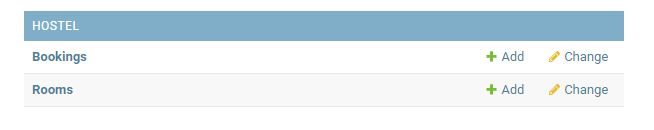
And, now, you will be able to create new bookings and add Rooms in the admin panel.
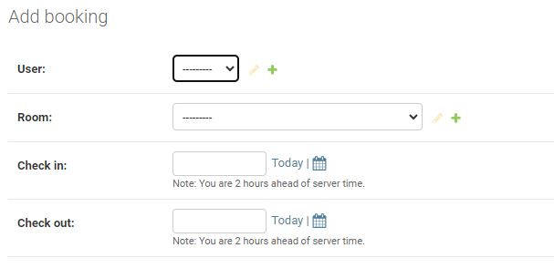
Then, it is needed to register the model in the admin.py file by adding the following lines:

```Python
admin.site.register(Room)
admin.site.register(Booking)
```

To see the full definition of the models, please refer to the code (admin.py and models.py files).
</details>

<a name="heroku-deployment"></a>
### Heroku Deployment
* Click Deploy tab in Heroku
* In the 'Deployment method' section select 'Github' and click the 'connect to Github' button to confirm.
* In the 'search' box enter the Github repository name for the project: favoureats: https://github.com/ellikarg/firsteverfullstack
* Click search and then click connect to link the heroku app with the Github repository. The box will confirm that heroku is connected to the repository.

<a name="final-deployment"></a>
### Final Deployment
In the IDE: 
* When development is complete change the debug setting to: `DEBUG = False` in `settings.py` 
* In Heroku settings config vars change the DISABLE_COLLECTSTATIC value to 0
* Because DEBUG must be switched to True for development and False for production it is recommended that only manual deployment is used in Heroku. 
* To manually deploy click the button 'Deploy Branch'. The default 'main' option in the dropdown menu should be selected in both cases. When the app is deployed a message 'Your app was successfully deployed' will be shown. Click 'view' to see the deployed app in the browser.

<a name="local-deployment"></a>
### Local Deployment: Forking and Cloning
**FORKING THE REPOSITORY**
* To fork the project navigate to the favoureats repository at https://github.com/ellikarg/firsteverfullstack
* Above the list of files click the dropdown code menu.
* Select the https option and copy the link.
* Open the terminal.
* Change the current working directory to the desired destination location.
* Click the 'Fork' button at the top right of the page. A forked copy of the repository will appear in your Repositories page.
**CLONING THE REPOSITORY**
* On Github navigate to the main page of Favoureats at https://github.com/ellikarg/firsteverfullstack
* Above the list of files click the dropdown code menu.
* Select the https option and copy the link.
* Open the terminal.
* Change the current working directory to the desired destination location.
* Type the git clone command with the copied URL: 
`git clone https://github.com/ellikarg/firsteverfullstack.git`.
* Press enter to create the local clone.
* For the project to run an env.py file must be created as in step 4 of 'creating your Heroku app' above. As this is not stored in Github it will not be cloned with the rest of the files.

<a name="credits"></a>
## Credits
- Credits must go to Paulo Arbelaez who created the README section "Project setup" and allowed me to use it here and for other future purposes as a guide-along
- also credits must go to siobhanlgorman, whose README I also used as a blue print

<a name="media"></a>
### Media
The images used were all taken by the developer. The logo used is the official logo from the Memorial da Capoeira and is used ligitimately.

<a name="code"></a>
### Code
- inspiration for the authentication and authorization feature from the walktrhough project (I think therefore I blog)
- getting a datepicker field for the form in order to be able to book a room: https://www.youtube.com/watch?v=I2-JYxnSiB0
- guidance with the booking system for the hostel: https://www.youtube.com/watch?v=yenjz1Wv9Yo
- disabling the dates that lie in the past in the datepicker: https://stackoverflow.com/questions/70272628/how-to-disable-to-type-in-html-input-date-when-choosing-past-dates/70273154#70273154

<a name="acknowledgments"></a>
## Acknowledgments
I would like to thank a few people who helped me get through this project:
- my Mentor for the support and pacience
- Belen, a friend, who gave me her appartment for the days before the project deadline where it was wonderfully quiet and perfect for concentration ;)
