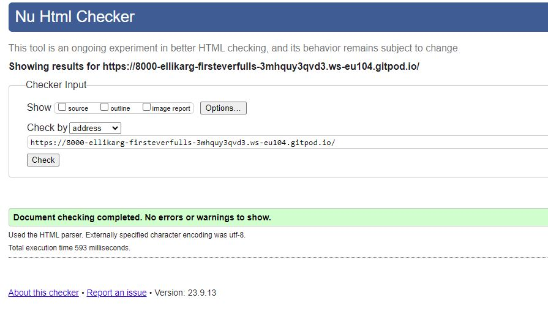
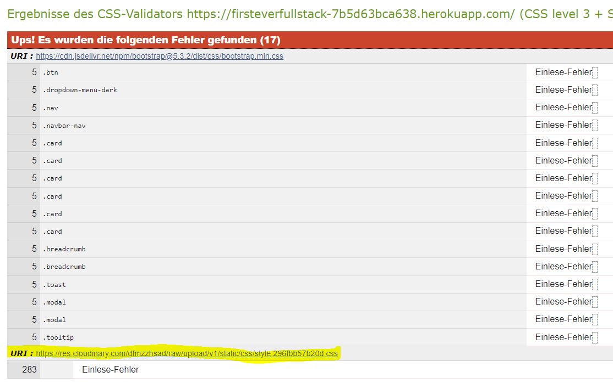
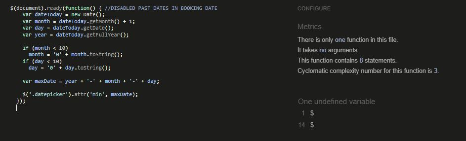
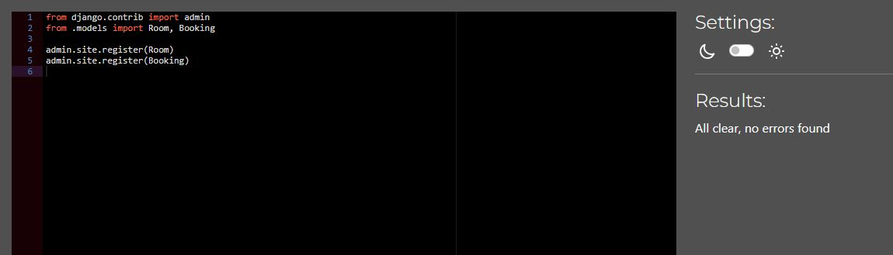
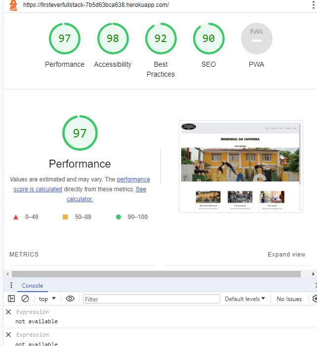

# Memorial da Capoeira -  Testing

[Back to README](README.md)

- - -

## CONTENTS

* [VALIDATION](#validation)
    1. [HTML Validation](#html-validation)
    2. [CSS Validation](#css-validation)
    4. [JavaScript Validation](#javascript-validation)
    5. [PEP8 Validation](#pep8-validation)
    6. [Accessibility & Performance](#accessibility-and-performance)
* [MANUAL TESTING](#manual-testing)
  * [Manual Python Testing](#manual-python-testing)
  * [Testing User Stories](#testing-user-stories)
  * [Full Testing](#full-testing)
* [BUGS](#bugs)
  * [Solved Bugs](#solved-bugs)
  * [Known Bugs](#known-bugs)

- - -

## VALIDATION

### HTML Validation

HTML Validation was done with [The WEC Markup Validation Service](https://validator.w3.org/). There were no errors found.

Testing Result

### CSS Validation

The CSS was tested by the [W3C CSS Validator](https://jigsaw.w3.org/) and there were many errors found due to the bootstrap libraries. For my own css file, there was no error detected.

Testing Result

### JavaScript Validation

I used [JSHint Static Code Analysis Tool](https://jshint.com/) for JavaScript to validate the Javascript files. There were no errors found.

Testing Result

### PEP8 Validation

The code of the admin, forms, models, urls and views files was passed through the [PEP8 linter](https://pep8ci.herokuapp.com/) and there are no problems apart from sometimes too long lines. This seems to happen with some django settings, where no linebreak is possible or advisable.

Testing Result

### Accessibility & Performance

Lighthouse testing has been done for all pages and the percentage was always in the green area - apart from the pages with big images, which had a slightly worse performance because of the size of the images.

Testing Result

- - -

## MANUAL TESTING

### Manual Python Testing

I have manually tested the website by doing the following:
- given that the room is already booked, there is an error message stating to choose another room or date
  
- given that the room is available, there is a success message displayed and the user is directed back to the Room Booking page
  
- given that the user inserts a check in date that lies after the check out date, there will be a message displayed stating exactly that
  
- all dates in the past are disabled, so that the user cannot by coincidence book a room in a past date
- the user is able to delete a booking 

### Testing User Stories

`Site Users`

| Goals | How are they achieved? |
| :--- | :--- |
| As a Site User I can understand the structure of the website so that I can navigate it easily | There is a navbar on the top of the page and a more visual navigation on the homepage with the bootstrap cards. |
| As a Site User I can use the nav bar so that I can navigate the pages easily | The navbar is clearly structured and all the links work. |
| s a Site User I can check the footer so that I can know the address of the hostel | The footer is existent on every page and always stays at the bottom of the page. |
| As a Site User I can understand if a room is available so that I can confirm my booking | There are messages popping up dependend on whether the room is already booked or still available. |
| As a Site User I can navigate to the "Academy" page so that I can read about the classes of the Memorial da Capoeira | On the academy page there is a bootstrap carousel with the different courses, date, time and locations |
| As a Site User I can log in so that I can make a booking | A user must be logged in to make a booking. If not so, she will be redirected to the login page |
| As a Site User I can manage my booking so that I can cancel my booking even afterwards | This is possible from the My bookings page |
| As a Site User I can manage my booking so that I can change my booking afterwards | The user is able to do all 4 CRUD-methods |
| As a Site User I can navigate to the "memorial" page so that I can read about the building and history of the Memorial da Capoeira | This could be a future feature, since it was only a "nice-to-have" it wasn't implemented yet |

`Admin`
| Goals | How are they achieved? |
| :--- | :--- |
| As an admin I can manage the users in the backend so that I can create and delete users, if necessary | This is possible in the admin panel |
| As an admin I can see all bookings in the front-end so that I could delete bookings for any user | The user sees only her own bookings, the admin sees the bookings of all users |
| As an admin I can use defensive programming so that I can prevent users from booking rooms in the past | This is not done by defensive programming, but by javascript, with which the dates in the past are disabled in the datepicker  |

### Full Testing

`Main Page`

| Feature | Expected Outcome | Testing Performed | Result | Pass/Fail |
| --- | --- | --- | --- | --- |
| Navbar | Entering the page, the navbar should link to all the displayed pages and the logo to the homepage | clicking the links | the links redirect to the according pages | Pass |
| the cards on the hompage  | shoud give an extra overview over the page and link to the according pages | clicking the links | the links redirect to the according pages | Pass |
| The footer  | should stick to the bottom of the page to give information, if needed | checked all pages | footer stays at the bottom | Pass |
| The carousel on the academy page  | should have three slides, with working buttons | tried the carousels | the carousel slides and the buttons work | Pass |
| Booking Room page  | should link to a booking form for each room form if the user is authenticated | tried the buttons (logged in and not logged in) | if user is authenticated, the buttons direct the user to the form for the according room. If not, they redirect to the login page.  | Pass |
| The booking form  | should work for booking a room and be validated for wrong values or other bookings (see Python testing above). Messages should be displayed to the user whether the booking has worked or she has to try another date | tried with different dates | the according messages are being displayd and the user redirected | Pass |
| The my bookings page | should be seen only by the authenticated users | tested (logged in and not logged in) | The page is only rendered to authenticated users | Pass |
| The delete booking link | should redirect to a page, that lets the user assure that she wants to delete the booking, then should delete it | deleted bookings | the bookings are deleted and a message is displayed to the user that the deletion was successful (see Python testing above) | Pass |
| The change booking link | should redirect the user to the booking form and then change the date of the booking according to the user input | chenged bookings | the bookings can be changed easily | Pass |
| Signin form | should let the user sign in and provide a link to the registration page as well | signed in with different users | Bootstrap signin form works perfectly fine | Pass |
| Signout form | should let the user sign out after she assures that she wants to sign out |signed out with different users | Bootstrap signout form works perfectly fine | Pass |
| Registration form | should let the user register | signed up with different users | Bootstrap signout form works perfectly fine | Pass |

- - -

## BUGS

### Solved Bugs

| No | Bug | How I solved the issue |
| :--- | :--- | :--- |
| 1 | In the setup, my virtual environment didn't let me install any packages | I changed the "include-system-site-packages" boolean value to true in the pyvenv.cfg file. Check: https://stackoverflow.com/questions/57801495/pip-wont-install-packages-in-virtualenv |
| 2 | The deployment to heroku was not easy, since I first used css-background-images which did not work with the cloudinary storage. | I changed the css-background-images to normal images, which was not visually as attractive anymore. Maybe with more time I could have managed to render the page as beautiful as before |

- - -

### Known Bugs

| No | Bug | |
| :--- | :--- | :--- |
| 1 | No known bugs |  |
